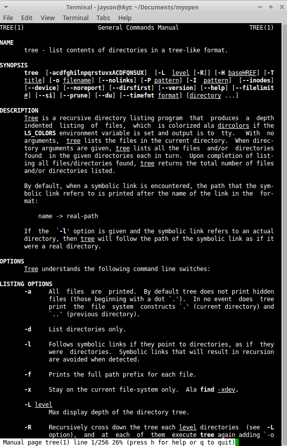
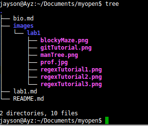
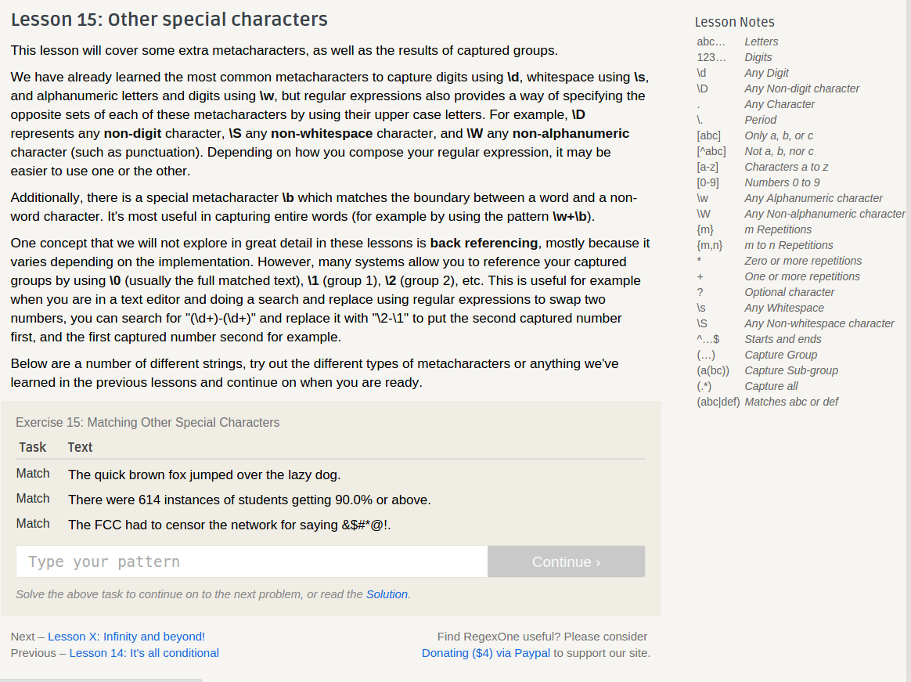
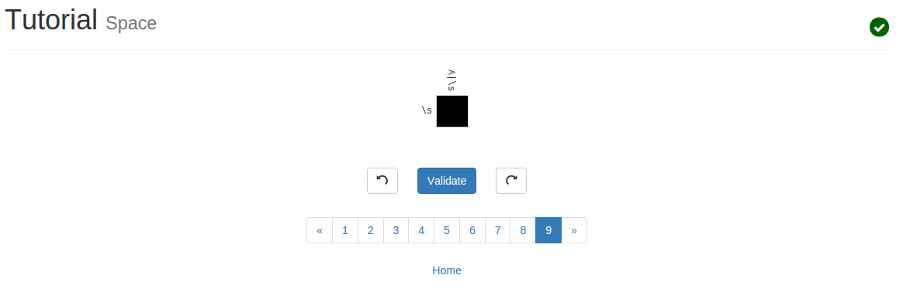
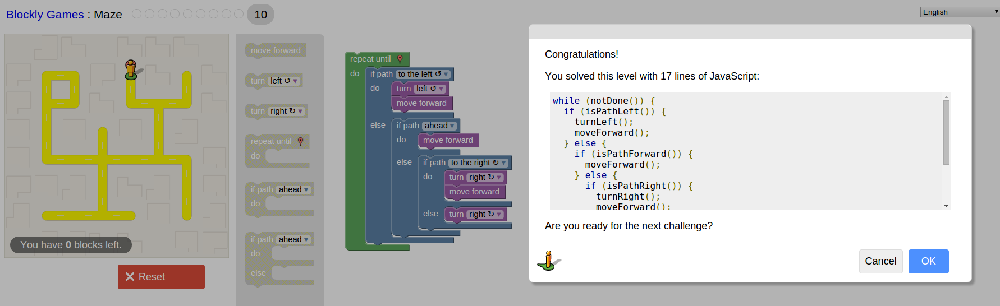
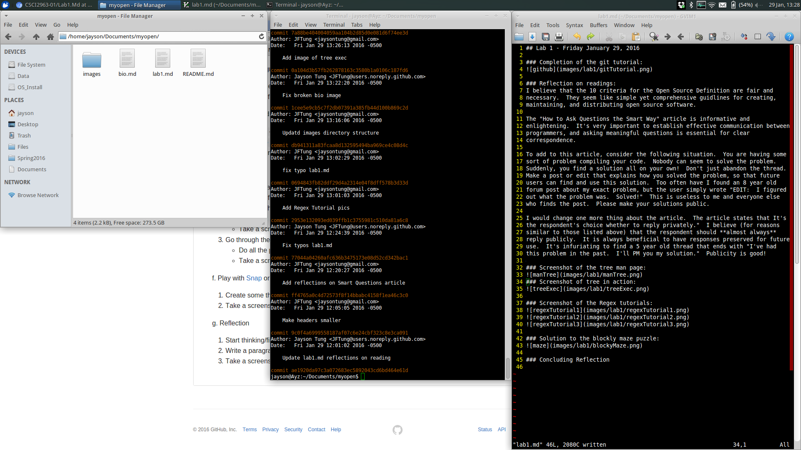

## Lab 1 - Friday January 29, 2016

### Completion of the git tutorial:

### Reflection on readings:
I believe that the 10 criteria for the Open Source Definition are fair and
necessary.  They seem like simple yet comprehensive guidlines for creating,
maintaining, and distributing open source software.

The "How to Ask Questions the Smart Way" article is informative and
enlightening.  It's very important to establish effective communication between
programmers, and asking meaningful questions is essential for clear
correspondence.

To add to this article, consider the following situation.  You are having some
sort of problem compiling your code.  Nobody can seem to solve the problem.
Suddenly, you find a solution all on your own!  Don't just abandon the thread.
Make a post or edit that explains how you solved the problem, so that future
users can find and use this solution.  Too often have I found an 8 year old
forum post about my exact problem, but the user simply wrote "EDIT:  I figured
out what the problem was.  Solved!"  This is useless to me and everyone else
who finds the post.  Please make your solutions public.

I would change one more thing about the article.  The article states that It's
the respondent's choice whether to reply privately."  I believe (for reasons
similar to those listed above) that the respondent should **almost always**
reply publicly.  It is always beneficial to have responses preserved for future
use.  It's infuriating to find a 5 year old thread that ends with "I've had
this problem in the past.  I'll PM you my solution."  Publicity is good!

### Screenshot of the tree man page:

### Screenshot of tree in action:

### Screenshot of the Regex tutorials:

### Solution to the blockly maze puzzle:

### Concluding Reflection
#### Screenshot of my Xubuntu workspace:

I am running exclusively Xubuntu on my laptop (no Windows).  I use Vim as my
prefered text editor, and I pushed my local edits to my repository onto GitHub
using the terminal.  I used the Linux "shutter" package to take the screenshots
for this lab.

#### Projects I'm Interested In
I would be interested in making some type of game.  However, I am open to other
ideas.  I think it would be fun to make some type of productivity tool.  While
I have experience creating CLI programs, I have no experience with GUI, so I'll
either have to learn GUI or stick to CLI.
