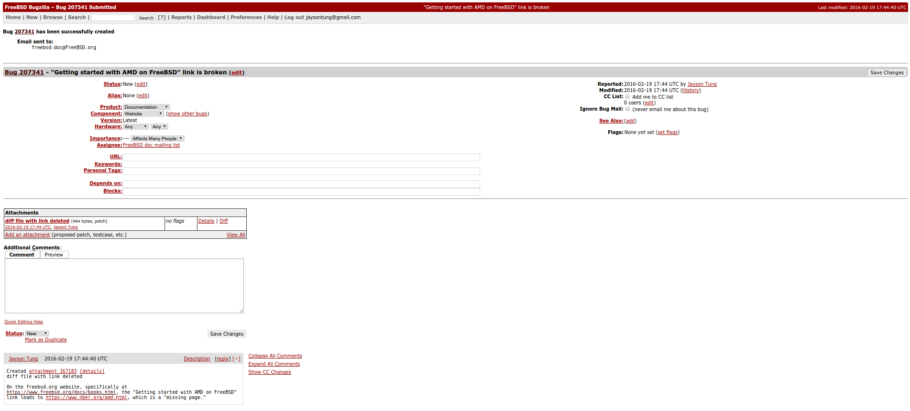

## Lab 4 - Friday February 19, 2016

### Bug Number 1:

On the FreeBSD website, specifically on this page
https://www.freebsd.org/docs/books.html, the link on the bottom of the page
under "Articles on other web sites" labeled "Getting started with AMD on
FreeBSD" leads to "https://www.nber.org/amd.html", which is a "missing page."
I checked out the page using svn and made a diff file after deleting the link.
I submitted a bug report including this diff file.

Link to diff file related to the above bug:  [myfix.diff](files/myfix.diff)

Screenshot of "Getting started with AMD on FreeBSD" broken link bug report:

### Bug Number 2:

