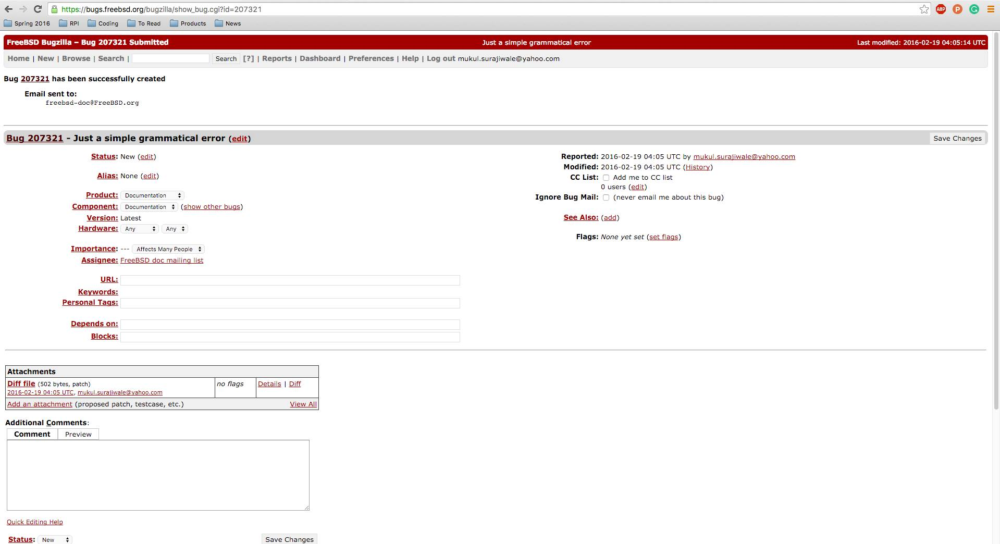

## Lab 4 - Friday February 19, 2016

### Bug Number 1:

On the FreeBSD website, specifically on this page
https://www.freebsd.org/docs/books.html, the link on the bottom of the page
under "Articles on other web sites" labeled "Getting started with AMD on
FreeBSD" leads to "https://www.nber.org/amd.html", which is a "missing page."
I checked out the page using svn and made a diff file after deleting the link.
I submitted a bug report including this diff file.

Link to diff file related to the above bug:  [myfix.diff](files/myfix.diff)

Screenshot of "Getting started with AMD on FreeBSD" broken link bug report:

### Bug Number 2:

The second bug was a more minor typo/grammar fix.  We found an extraneous comma
and deleted it.

Link to diff file related to the above bug:
[grammarFix.diff](files/grammarFix.diff)

Screenshot of extraneous comma "bug" report:

### Conclusion

It is important to maintain documentation in any project involving many
contributors.  Good documentation provides essential information that all
contributrors will need access to in order to continue effective development on
the project.  Everyone has their own coding style, and it is important that
everyone is on the same page about what the code means.  Good documentation
also keeps the users informed about how the project is changing and what they
should expect in the future.

I learned that no matter how old a project is, there WILL be small errors
somewhere in the documentation.  People won't always check if links are still
working, and some contributors don't even speak English as their first
language, which can lead to any number of documentation "bugs."
